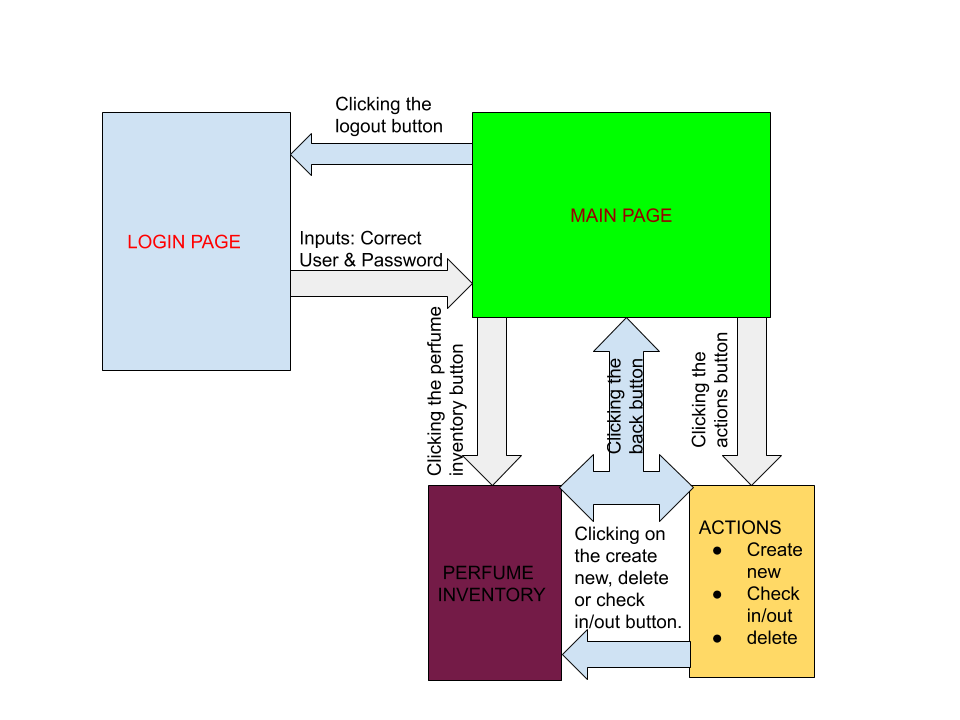

# Unit-3

Contents
--------
  1. [Planning](#planning)
  1. [Design](#design)
  1. [Development](#development)
  1. [Evaluation](#evaluation)
  
## Planning
### Definition of problem
The client for this application is Hassan Ali, a lover of perfumes. He has so much perfumes of different brands, sizes and content. They all smell soo good and sometimes he can spend lots of minutes thinking of what perfume to use for heading out for school. This action comes at his expense because he usually misses breakfast and comes late for his first period classes. Hassan has also found it hard to account for his numerous perfumes. He tends to lose a lot of them and it has become a hell of a job to organize his perfumes. 

### Proposed solution
I am going to create an application that helps Hassan organize his perfumes in the form of an inventory. On opening the application, there would be a feature that informs him on the recommended perfume to use that particular day. This application will also be only accessible to him.
I will make use of the Python programming language to develop this application. My justification for using Python is due to its ability to give better results, agility and user experience to the customers. GitHub along with many other portals have positioned Python in top 10 languages for mobile application development. What makes Python easy to understand is its unmistakable, natural and basic syntax that looks like English. Such features make Python the best choice for amateurs.[1]

### Success Criteria
1. Application must be secure. No other person should be able to gain unauthorized access.
2. There should be a recommended perfume for that season when the client opens the application.
3. Click system to check out or use perfume and informs client when perfume was last used.
4. Client should be able to create or add a new perfume to his inventory.
5. Client should be able to delete or remove an existing perfume from his inventory.
6. Client should be able to edit a perfume in his inventory.
7. Application should be visually pleasing.
8. Application should be easy to use.

### TELOS feasibility study
See file below:


## Design
### Record of Tasks
| Task number | Planned action                                                                                             | Expected outcome                                                            | Time       | Target completion |
|-------------|------------------------------------------------------------------------------------------------------------|-----------------------------------------------------------------------------|------------|-------------------|
| 1           | Planning: Meet with client for the first conversation.                                                     | Obtain the basic client requirements.Sketch basic system diagram.           | 10 minutes | February 14.      |
| 2           | Planning: Second meeting with client to confirm success criteria.                                          | Rank the client requirements in order of importance.                        | 5 minutes  | February 14.      |
| 3           | Planning: Undergo a feasibility study to show whether it is possible to create this application.           | Feasibility study undergone; application can be created.                    | 2 days     | February 17.      |
| 4           | Design: Create a table to record my tasks.                                                                 | Successfully created a record of tasks table.                               | 30 days    | April 27.         |
| 5           | Design: Draw the first sketch of pages for the application.                                                | Drew the first sketch of pages for the application.                         | 30 minutes | February 26       |
| 6           | Design: Design the sketch pages on QT Designer                                                             | Designed the sketch pages on QT Designer                                    | 60 minutes | March 6           |
| 7           | Planning: Meet with client to display designed pages                                                       | Obtain feedback on improvements to the pages.                               | 5 minutes  | March 11.         |
| 8           | Development: Convert the pages to .py format and code the main page.                                       | Programmed the application.                                                 | 30 days    | April 28.         |
| 9           | Development: Connect all the pages of my application.                                                      | Connected all pages of application                                          | 2 days     | April 3           |
| 10          | Development: Third meeting with client to take pictures of perfumes.                                       | Obtained all pictures and information of client's perfumes                  | 15 minutes | April 3.          |
| 11          | Development: Upload the pictures to the application.                                                       | Write a program to upload the pictures to the application.                  | 2 hours    | April 12.         |
| 12          | Design: Draw the system diagram for the application.                                                       | Drawn a system diagram of the application.                                  | 2 hours    | April 24.         |
| 13          | Design: Draw the test plan for the application and test the various parts of the application.              | Designed a test plan for testing the application and test the  application. | 3 days     | April 28.         |
| 14          | Development: Provide detailed instructions to obtain hashed password and user from my client.              | Obtained hash password and user from client.                                | 2 days     | April 26.         |
| 15          | Development: Create a successful login.                                                                    | Created a successful login for my client.                                   | 2 days     | April 27.         |
| 16          | Design: Draw the required flowcharts.                                                                      | Drawn the flowcharts.                                                       | 2 days     | April 28.         |
| 17          | Evaluation: Assess the usability and functionality of the app based on the test plan and success criteria. | Application has been fully assessed using test plan.                        | 3 days     | April 28.         |
| 18          | Evaluation: Document tips for improvement.                                                                 | Tips for improvement have been given and documented.                        | 3 days     | April 28.         |
| 19          | Evaluation: Record video to show programs functionality.                                                   | Video is recorded successfully.                                             | 2 days     | April 28.         |

### Design of Pages

This image shows the initial drawing for the pages of the application. The first one is the login page, followed by the main page, the third is the perfume inventory pages and lastly, the actions page.

Inputing the correct username and password directs you to the main page. The main page has three buttons to select. The perfume inventory button directs you to the perfume inventory page, The actions button directs you to the actions page where you can either create or add a new perfume, delete an existing perfume or check in and check out a perfume when used. 

### System Diagram


### Test Plan
| Test Number | Description                                                                                  | Input Data/Instructions                                                                                                                   | Expected Results                                                                                                                                                              |
|-------------|----------------------------------------------------------------------------------------------|-------------------------------------------------------------------------------------------------------------------------------------------|-------------------------------------------------------------------------------------------------------------------------------------------------------------------------------|
| 1           | Ability to login successfully with the in-built passwords.                                   | Specific username & password                                                                                                              | The program should output "logging in". The login page closes and we are directed to the main page.                                                                           |
| 2           | Image of recommended perfume should  appear on opening of main page.                         | Run the application and put the correct passwords.                                                                                        | Main page should appear with a picture of one of the  client's perfumes.                                                                                                      |
| 3           | All pages of the app are connected.                                                          | Run the applications and navigate through all the pages.                                                                                  | All pages should be connected. Smooth transition from  one page to another.                                                                                                   |
| 4           | Client should be able to add a new perfume to his inventory table.                           | Run the app, navigate to the actions page, click create new and add the information for the new perfume. Click the save button.           | The client should be able to get to the table when the  create new button is clicked, and can add information about a new perfume on the unoccupied rows.                     |
| 5           | Client should be able to delete an existing new perfume in his inventory table.              | Run the app, navigate to the actions page, click delete button and delete all information for an existing perfume. Click the save button. | The client should be able to get to the table when the  delete button is clicked, and can delete information about an existing perfume.                                       |
| 6           | Client should be able to edit information  about an existing perfume in his inventory table. | Run the app, navigate to the actions page, click delete button and edit the information for an existing perfume. Click the save button.   | The client should be able to get to the table when the  check in/out button is clicked, and can check in/out a perfume when it is being used and when it is no longer in use. |
| 7           | Client should be able to check in and out an existing perfume when used.                     | Run the app, navigate to the actions page, click check in/out button and add check in/out a perfume when used. Click the save button.     | The client should be able to get to the table when any of the action buttons are clicked and can edit information about a perfume.  |


## Development

```.py
mysecretpass = '2'
user = 'H'

    def trylogin(self):
        # 1. get the name
        # 2. get the password
        # 3. compare name entered and stored
        # 4. same with password
        nameEntered = self.email_in.text()
        passEntered = self.pssword_in.text()
        print(nameEntered)
        print(passEntered)

        self.email_in.setStyleSheet("border: none")
        self.pssword_in.setStyleSheet("border: none")

        if nameEntered != user and passEntered != mysecretpass:
            self.email_in.setStyleSheet("border: 2px solid red")
            self.pssword_in.setStyleSheet("border: 2px solid red")
            print('1')
        elif nameEntered != user:
            self.email_in.setStyleSheet("border: 2px solid red")
            print('2')
        elif passEntered != mysecretpass:
            self.pssword_in.setStyleSheet("border: 2px solid red")
            print('3')
        else:
            self.email_in.setStyleSheet("border: 2px solid green")
            self.pssword_in.setStyleSheet("border: 2px solid green")
            print('passwords okay')
            self.done(0)
```
The snippet of the code shows the steps for logging in. Since the application is to be accessed by only one person, I conversed with my client and had a password and username fixed with him. The program is already inbuilt with a correct password and username. Any person ,including my client, trying to access the app has to input a username and password.
The if statement is used to compare the values inputed by a person and the inbuilt password and username. The borders of the input boxes are white initially. If one or both of the values are wrong, the border(s) of the wrong input box becomes red. If both are correct, it is green and login is successful. The use of 'if' statements here shows my algorithmic thinking. 

```.py
perfumes = ['bravespirit.png', 'darkcrude.png', 'icewalk.png', 'libyan.png', 'manuomo.png', 'metallicspirit.png', 'nighthomme.png', 'summerco.png', 'winterco.png']
p = random.randint(0,len(perfumes))
        s = "#perfume_img{{background-image:url(IMAGES/{});}}".format(perfumes[p])
        print(s)
        self.setStyleSheet(s)
```
This code snippet is used to show a recommended perfume anytime the system is run. There is a list containing the images of all the perfumes. The code randomly picks a number from 0 to the number of perfumes we have. Each number picked represents a position of a perfume in the list. When one is picked, it is displayed on the home page. This also improves the visual content of this app. The use of random, list and setStlyeSheet shows my knowledge of Python functions.

```.py
    self.perfumeinventory.clicked.connect(self.openinventory)
    self.actions.clicked.connect(self.openactions)
    self.logout.clicked.connect(self.logOut)


 def openinventory(self):
        var = InventoryWindow(self)
        var.show()

 def openactions(self):
        var = PerfumeActions(self)
        var.show()

 def logOut(self):
        var = LoginApp(self)
        var.show()
```
This code snippet connects the buttons of the mainpage to the other pages in the app. The first three lines of code are executed when the buttons perfumeinventory,actions and logout are pressed. For example, When perfumeinventory is pressed, it connects to a method(self.openinventory) that gives the app instructions on what to do which is to open up the InventoryWindow.  

```.py
self.createnew.clicked.connect(self.createp)
self.pushButton.clicked.connect(self.deletep)
self.checkinout.clicked.connect(self.checkp)


    def createp(self):
        var = InventoryWindow(self)
        var.show()

    def deletep(self):
        var = InventoryWindow(self)
        var.show()

    def checkp(self):
        var = InventoryWindow(self)
        var.show()
```
This code snippet is the first step to acheiving our goals of being able to create, check in/out and delete perfumes. These lines of code are contained in the class PerfumeActions since that is the window in which the create, check in/out and delete buttons are found. The code connects the buttons to the InventoryWindow where the table inventory is found.

```.py
self.tableinventory.cellChanged.connect(self.changeDB)  
self.savechanges.clicked.connect(self.save)             
self.revertchanges.clicked.connect(self.cancel)

 def changeDB(self):                                                                  
     item = self.tableinventory.currentItem()                                         
     row = self.tableinventory.currentRow()                                           
     column = self.tableinventory.currentColumn()                                     
     self.tableinventory.item(row, column).setBackground(QtGui.QColor(100, 100, 150)) 
     print(item.text())                                                               
     self.savechanges.setDisabled(False)                                              
     self.revertchanges.setDisabled(False)                                            
                                                                                      
 def save(self):                                                                      
     with open('data.csv', 'w', newline='') as dt:                                    
         writer=csv.writer(dt)                                                        
         row_max = self.tableinventory.rowCount()                                     
         col_max = self.tableinventory.columnCount()                                  
                                                                                      
         for row in range(row_max):                                                   
             line = []                                                                
             for col in range(col_max):                                               
                 data=self.tableinventory.item(row, col)                              
                 if data is not None:                                                 
                     line.append(data.text())                                         
             writer.writerow(line)                                                    
     print("Save to data.csv")                                                        
                                                                                      
 def cancel(self):                                                                    
     self.load_data()                                                                 
     print("Reload table")
```
This snippet of code aims at acheiving the success criteria of being able to create, delete, edit and check in or out a perfume.

```.py
import hashlib, binascii, os

def hash_password(password):
    salt = hashlib.sha256(os.urandom(60)).hexdigest().encode('ascii')
    pwdhash = hashlib.pbkdf2_hmac('sha512', password.encode('utf-8'),
                                  salt, 100000)
    pwdhash = binascii.hexlify(pwdhash)
    return (salt + pwdhash).decode('ascii')

def verify_password(stored_password, passEntered):
    salt = stored_password[:64]
    stored_password = stored_password[64:-1]
    pwdhash = hashlib.pbkdf2_hmac('sha512',
                                  passEntered.encode('utf-8'),
                                  salt.encode('ascii'),
                                  100000)
    pwdhash = binascii.hexlify(pwdhash).decode('ascii')
    return pwdhash == stored_password


password = input("Hello Mr. Hasan, input your username & password together(no spaces in between them): ")
hash = hash_password(password)
print(hash)
print("Mr Hasan, send this password to the programmer: {}".format(hash))

nameEntered = self.email_in.text()                       
passEntered = self.pssword_in.text()                     
passE = nameEntered + passEntered                        
with open('pass.txt', "r") as pt:                        
    for stored_password in pt:                           
        if myLib.verify_password(stored_password, passE):
            self.done(0)
```
Since my client wants to have sole access to this application, I created a program such that the password and user given to be by my client cannot be known by me.
                                                        
## Evaluation
| Test Number | Description                                                                                  | Input Data/Instructions                                                                                                                   | Expected Results                                                                                                                                                              | Results Acheived? |
|-------------|----------------------------------------------------------------------------------------------|-------------------------------------------------------------------------------------------------------------------------------------------|-------------------------------------------------------------------------------------------------------------------------------------------------------------------------------|-------------------|
| 1           | Ability to login successfully with the in-built passwords.                                   | Specific username & password                                                                                                              | The program should output "logging in". The login page closes and we are directed to the main page.                                                                           | YES               |
| 2           | Image of recommended perfume should  appear on opening of main page.                         | Run the application and put the correct passwords.                                                                                        | Main page should appear with a picture of one of the  client's perfumes.                                                                                                      | YES               |
| 3           | All pages of the app are connected.                                                          | Run the applications and navigate through all the pages.                                                                                  | All pages should be connected. Smooth transition from  one page to another.                                                                                                   | YES               |
| 4           | Client should be able to add a new perfume to his inventory table.                           | Run the app, navigate to the actions page, click create new and add the information for the new perfume. Click the save button.           | The client should be able to get to the table when the  create new button is clicked, and can add information about a new perfume on the unoccupied rows.                     | YES               |
| 5           | Client should be able to delete an existing new perfume in his inventory table.              | Run the app, navigate to the actions page, click delete button and delete all information for an existing perfume. Click the save button. | The client should be able to get to the table when the  delete button is clicked, and can delete information about an existing perfume.                                       | YES               |
| 6           | Client should be able to edit information  about an existing perfume in his inventory table. | Run the app, navigate to the actions page, click delete button and edit the information for an existing perfume. Click the save button.   | The client should be able to get to the table when the  check in/out button is clicked, and can check in/out a perfume when it is being used and when it is no longer in use. | YES               |
| 7           | Client should be able to check in and out an existing perfume when used.                     | Run the app, navigate to the actions page, click check in/out button and add check in/out a perfume when used. Click the save button.     | The client should be able to get to the table when any of the action buttons are clicked and can edit information about a perfume.                                            | YES               |

### Tips for improvement:
#### 1. Button for adding more rows:
My table inventory is limited to a certain number of rows. If the number of perfumes my client owns exceeds the number of rows avaibale for data entry, then the app will be of less use to him and the app will not also fulfill the success criteria of being able to create new perfumes.
#### 2. More color:
One of my clients requirements was to make this application visually pleasing. There are pictures in the app but no color. One of the things I can do to improve this app is to add color.
#### 3. A search button.


### References
[1] Retrieved from https://topofstacksoftware.com/2019/01/09/10-best-programming-languages-for-mobile-app-development/ on 15th February 2020.
